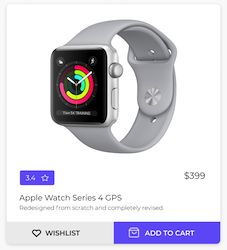

# Card component

Необхідно реалізувати Card компонент, який буде відповідати за відображення карточки товару.



На вхід компонент має приймати об'єкт виду:

```json
{
  "id": "76w0hz7015kkr9kjkav",
  "images": [
    img,
    img
  ],
  "title": "Ноутбук Acer Aspire 3 A315-57G-336G (NX.HZREU.01S) Charcoal Black",
  "rating": 2.89,
  "price": 15999,
  "category": "laptops",
  "brand": "acer"
}
```
